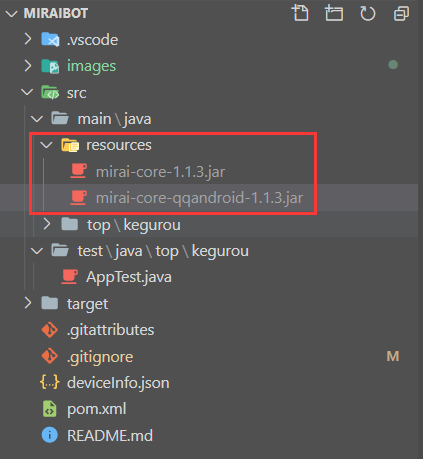

# miraibot

基于[Mirai-core](https://github.com/mamoe/mirai)的 Java 机器人

使用的包为 mirai-core-1.1.3.jar 和 mirai-core-qqandroid-1.1.3.jar 仓库地址[mirai-repo](https://github.com/project-mirai/mirai-repo)

本身是 mvn 项目，引入本地包，给包随便整个文件夹放着。



修改 pom.xml 给项目导入包，这里不要使用绝对地址，可能会引起 mvn 报错。

```xml
	<dependency>
      <groupId>net.mamoe</groupId>
      <artifactId>mirai-core</artifactId>
      <version>1.1.3</version>
      <scope>system</scope>
      <systemPath>${project.basedir}/src/main/java/resources/mirai-core-1.1.3.jar</systemPath>
    </dependency>
	<!-- 在线仓库的都试过了，有问题，等2.0的发版吧-->
    <dependency>
      <groupId>net.mamoe</groupId>
      <artifactId>mirai-core-qqandroid</artifactId>
      <version>1.1.3</version>
      <scope>system</scope>
      <systemPath>${project.basedir}/src/main/java/resources/mirai-core-qqandroid-1.1.3.jar</systemPath>
    </dependency>
```

哦，git 不会 pull jar 文件，所以这个仓库里也就没有这两个包，所以写在这里说一下。

7-23 号更新：写了夸人和骂人的功能，测试了一下发送消息的 MessageChain 下的消息类（文本，at，图片）和拼接方式
到最后实在是把\[mirai:at:1234567890,@莫晴\] 这一部分内容拿不出来。获取不到被 at(TargetId)的 QQ 号，无法去指定艾特某一个人。之后再看把。
